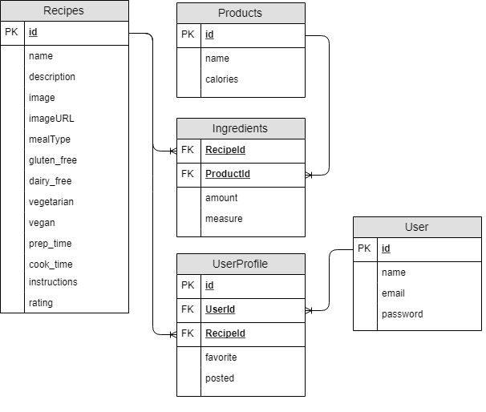

# Project-2

## Team Wolves
* Team Members
  * Geetha
  * Nivi Amanjee
  * Tulus 

## Project Description
* The web site will let users to search for and share their favorite recipes.

### Overall Concept
Cooking Recipe Web Site

* Main Features
   * Recipe search
   * Recipe post by users
   * Personalized user experience through login

## Web Page Layout
1. Main page
1. User Login & Register Page
1. Post Recipe
1. Search Recipe
1. User's Personalize Page


## Technology / NPM Packages Used
```
  "bcryptjs": "^2.4.3",
  "connect-flash": "^0.1.1",
  "dotenv": "^6.0.0",
  "express": "^4.16.3",
  "express-handlebars": "^3.0.0",
  "express-session": "^1.15.6",
  "multiparty": "^4.2.1",
  "mysql2": "^1.6.4",
  "passport": "^0.4.0",
  "passport-local": "^1.0.0",
  "request": "^2.88.0",
  "sequelize": "^4.41.2"
```

## Database Model/Schema



